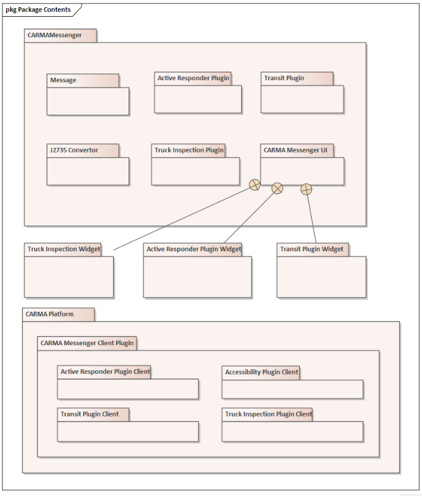

| CI Build Status | Sonar Code Quality |
|----------------------|---------------------|
[](https://github.com/usdot-fhwa-stol/carma-messenger/actions/workflows/ci.yml) | [](https://sonarcloud.io/dashboard?id=usdot-fhwa-stol_carma-messenger) |
# DockerHub Release Builds
| Carma Messenger UI  | Carma Messenger Config | Carma Messenger Core |
|-----|-----|-----|
[](https://hub.docker.com/repository/docker/usdotfhwastol/carma-messenger-ui) | [](https://hub.docker.com/repository/docker/usdotfhwastol/carma-messenger-config) | [](https://hub.docker.com/repository/docker/usdotfhwastol/carma-messenger-core)
# DockerHub Release Candidate Builds
| Carma Messenger UI  | Carma Messenger Config | Carma Messenger Core |
|-----|-----|-----|
[](https://hub.docker.com/repository/docker/usdotfhwastolcandidate/carma-messenger-ui) | [](https://hub.docker.com/repository/docker/usdotfhwastolcandidate/carma-messenger-config) | [](https://hub.docker.com/repository/docker/usdotfhwastolcandidate/carma-messenger-core)
# DockerHub Develop Builds
| Carma Messenger UI  | Carma Messenger Config | Carma Messenger Core |
|-----|-----|-----|
[](https://hub.docker.com/repository/docker/usdotfhwastoldev/carma-messenger-ui) | [](https://hub.docker.com/repository/docker/usdotfhwastoldev/carma-messenger-config) | [](https://hub.docker.com/repository/docker/usdotfhwastoldev/carma-messenger-core)


# carma-messenger

CARMA Messenger is a standalone research platform which is aimed to deploy on non-automated entities who participate in the transportation system, including first responders, transit vehicles, law enforcement vehicles, and pedestrians. It helps other vehicles or travelers communicate with CARMA Platform vehicles, sharing information and performing cooperative operations to improve transportation efficiency and safety. 

## Architecture

The core components in CARMA Messenger contains two ROS nodes origionally developed for the CARMA Platform communication stack: Message node and J2735 Convertor Node. The Message node takes in a ROS message and uses asn1c lib generated code to convert it to a binary blob and forwards it to the DSRC driver, such that any OBU/RSU can broadcast the message directly. The J2735 Converter converts the data from a ROS message based on the J2735 standard units to another message using more usable SI units and vice-versa.
<br>
To implement each CARMA messenger feature, different ROS nodes can be built to serve as plugins to CARMA Messenger platform. Their responsibilities are generating messages and responses to messages from CARMA Platform vehicles. Similar functionalities will be grouped under the same plugin. An example of this archetecture can be seen below. 

<br>
As shown in the diagram, any given piece of functionality may require client nodes running on the CARMA Platform which are configued to address the specific scenario under test. 
<br>
Additional documentation can be found on the [Doxygen Source Code Documentation page](https://usdot-fhwa-stol.github.io/documentation/carma-messenger).

## System Configuration and Installation

The carma-messenger system is meant to be run using docker. The configuration of carma-messanger is similar, though not identical, to configuring the CARMA Platform following the process described in the document [CARMA Platform Detailed Design - Parameter and Launch Standards for Different Vehicle Configurations.docx](https://usdot-carma.atlassian.net/wiki/spaces/CRMPLT/pages/196182019/CARMA3+Detailed+Design+Documentation). At the moment, the user does not need to configure any folders on the host vehicle except ensuring that the logging directories ```/opt/carma/logs``` and ```/opt/carma/.ros``` exist and are writeable. In addition, the user should utilize the [carma script](https://github.com/usdot-fhwa-stol/CARMAPlatform/blob/master/engineering_tools/carma) and [__carma_autocomplete file](https://github.com/usdot-fhwa-stol/CARMAPlatform/blob/master/engineering_tools/__carma_autocomplete) to launch and manage the system. The carma script can be placed under ```/usr/bin``` and the autocomplete file under ```/etc/bash_completion.d/``` (Ubuntu 16.04). 

```
sudo curl -o /usr/bin/carma -L https://raw.githubusercontent.com/usdot-fhwa-stol/carma-platform/develop/engineering_tools/carma
sudo chmod ugo+x /usr/bin/carma
sudo curl -o /etc/bash_completion.d/__carma_autocomplete -L https://raw.githubusercontent.com/usdot-fhwa-stol/carma-platform/develop/engineering_tools/__carma_autocomplete
sudo chmod ugo+x /etc/bash_completion.d/__carma_autocomplete
```
<br>

Hardware configurations are managed in the config directory of this repo. For local development the [development config](carma-messenger-config/development) folder may be used. The user can build this configuration image by calling ```./build-image.sh``` from inside that directory. This will create a carma-messenger-config image. The user can then set this as the target image using ```carma config set```. To start and stop the system, the user can call ```carma start all``` and ```carma stop all```. The UI should then be accessable from localhost in a browser.

### Example Setup

```
# Clone repo
mkdir carma-messenger-ws
cd carma-messenger-ws
mkdir src
cd src
git clone https://github.com/usdot-fhwa-stol/carma-messenger.git

# Build development config
cd carma-messenger/carma-messenger-config/development
./build-image.sh
docker image ls # Look for the newest carma-messenger-config image
carma config set usdotfhwastol/carma-messenger-config:<commit-hash>-development

# Build carma-messenger-core
cd ../../carma-messenger-core/docker
./build-image.sh -d # Build from develop branch of dependencies

# Build carma-messenger-ui
cd ../../carma-messenger-ui/docker
./build-image.sh -v test # Tag development image with test

# Launch CARMA Messenger
carma start all
```

# CARMAPlatform
The primary CARMAPlatform repository can be found [here](https://github.com/usdot-fhwa-stol/CARMAPlatform) and is part of the [USDOT FHWA STOL](https://github.com/usdot-fhwa-stol/)
github organization. Documentation on how the CARMAPlatform functions, how it will evolve over time, and how you can contribute can be found at the above links as well

## Contribution
Welcome to the CARMA contributing guide. Please read this guide to learn about our development process, how to propose pull requests and improvements, and how to build and test your changes to this project. [CARMA Contributing Guide](https://github.com/usdot-fhwa-stol/CARMAPlatform/blob/develop/Contributing.md) 

## Code of Conduct 
Please read our [CARMA Code of Conduct](https://github.com/usdot-fhwa-stol/CARMAPlatform/blob/develop/Code_of_Conduct.md) which outlines our expectations for participants within the CARMA community, as well as steps to reporting unacceptable behavior. We are committed to providing a welcoming and inspiring community for all and expect our code of conduct to be honored. Anyone who violates this code of conduct may be banned from the community.

## Attribution
The development team would like to acknowledge the people who have made direct contributions to the design and code in this repository. [CARMA Attribution](https://github.com/usdot-fhwa-stol/carma-platform/blob/develop/ATTRIBUTION.md) 

## License
By contributing to the Federal Highway Administration (FHWA) Connected Automated Research Mobility Applications (CARMA), you agree that your contributions will be licensed under its Apache License 2.0 license. [CARMA License](https://github.com/usdot-fhwa-stol/CARMAPlatform/blob/develop/docs/License.md) 

## Contact
Please click on the CARMA logo below to visit the Federal Highway Adminstration(FHWA) CARMA website.

[](https://highways.dot.gov/research/research-programs/operations/CARMA)


